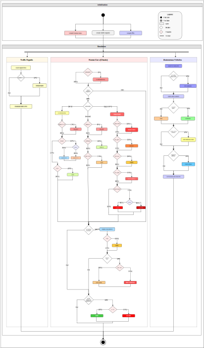
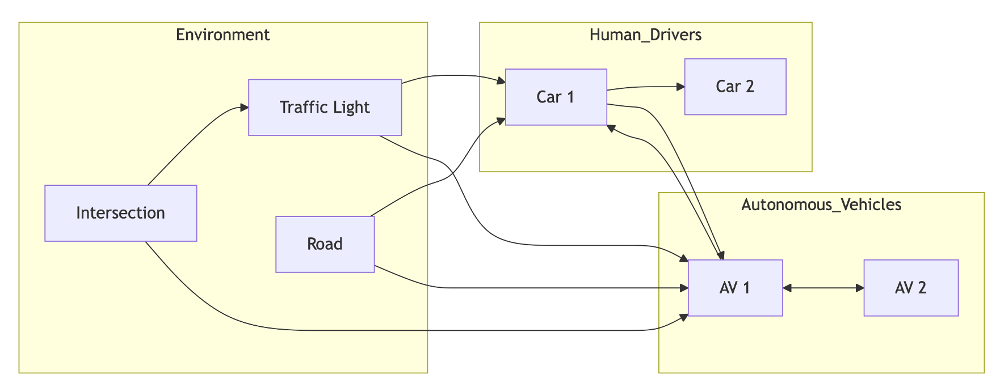
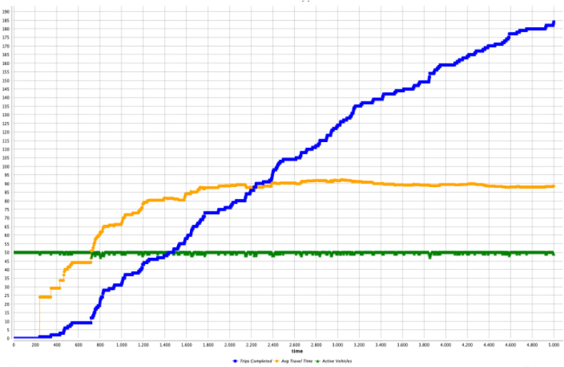
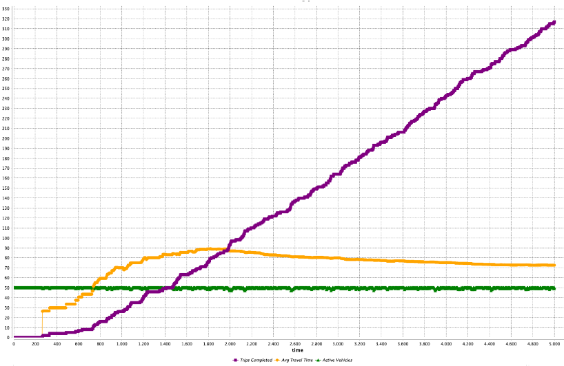
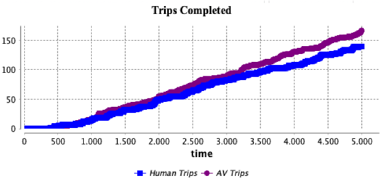
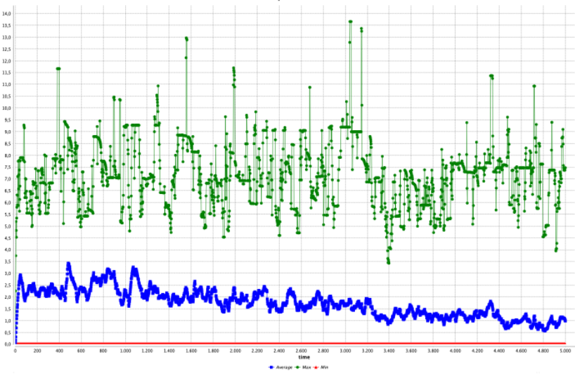
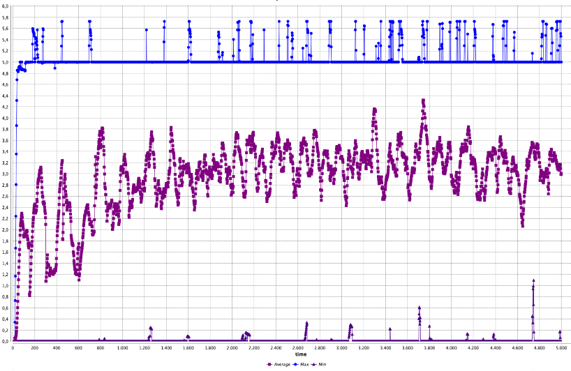
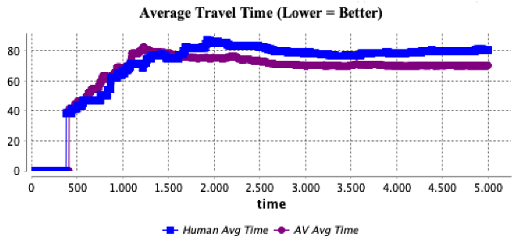

# TrafficSimulation
A GAML project to simulate human and autonomous drivers

For a detailed explanation of all variables, please see Wiki

# System overview

---

## Interactions

---

## Results comparison

### Throughput

- **Human-only:**  
  

- **Autonomous-only:**  
  

- **Mixed:**  
  

### Task time

- **Human-only:**  
  

- **Autonomous-only:**  
  

- **Mixed:**  
  
